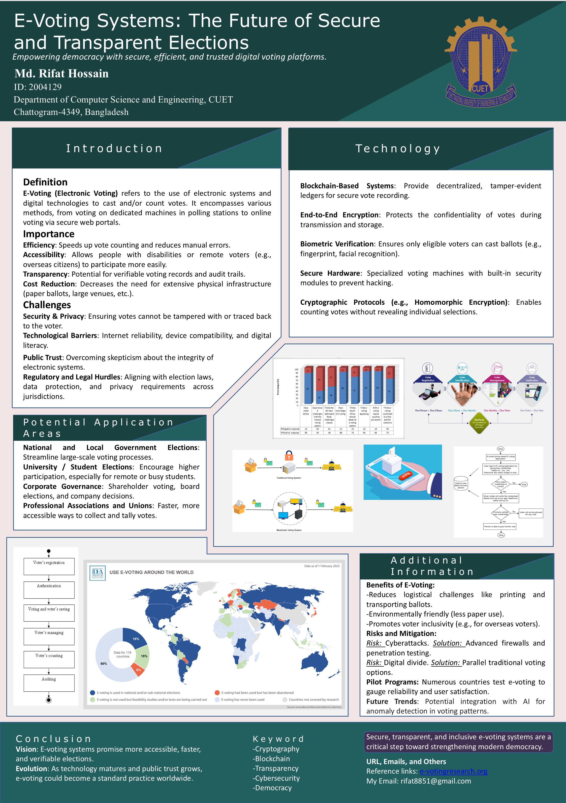

# E-Voting Systems: The Future of Secure & Transparent Elections

> **Empowering democracy with secure, efficient, and trusted digital voting platforms.**

[](https://github.com/RifatHossaiN47/research-poster-collection)
[](https://www.cuet.ac.bd/)
[](LICENSE)
[](#-quick-links--downloads)

---

## 📌 At a Glance

Hi there! 👋 This repository hosts the academic research poster on **E-Voting Systems**, presented by **Md. Rifat Hossain** from the **Department of Computer Science and Engineering, Chittagong University of Engineering and Technology (CUET)**.

Elections are the backbone of modern democracy, yet traditional paper-based elections face immense challenges: slow counting, high logistics overhead, ballot tampering risks, and limited accessibility for overseas or disabled citizens. This research explores how modern computer science technologies—**blockchain**, **homomorphic cryptography**, and **biometrics**—can make elections verifiable, transparent, and resilient against fraud.

---

## 🖼️ Poster Preview

<div align="center">
  <a href="final-versions/research-poster-final.pdf" target="_blank" title="Click to open full high-resolution PDF">
    
  </a>
  <br />
  <sub>💡 <em>Tip: Click the poster above to view the high-resolution, print-ready PDF.</em></sub>
</div>

---

## ⚡ Quick Links & Downloads

| Format | File Link | Best For |
| :--- | :--- | :--- |
| 📄 **Final Poster (PDF)** | [**`final-versions/research-poster-final.pdf`**](final-versions/research-poster-final.pdf) | Viewing, symposium sharing, & high-res printing |
| 🎨 **Editable Source (PPTX)** | [**`source-files/poster-source.pptx`**](source-files/poster-source.pptx) | Customizing layouts, graphics, and text |
| 🖼️ **Web Preview (PNG)** | [**`previews/poster-preview.png`**](previews/poster-preview.png) | Fast visual inspection & web embedding |
| 📦 **Template Archive** | [**`archive/demo.pdf`**](archive/demo.pdf) | Initial layout draft & template |

---

## 🔬 Core Highlights & Findings

### 1. Why E-Voting Matters
- **Speed & Precision**: Drastically reduces manual tally errors and eliminates multi-day ballot counting delays.
- **Inclusivity & Access**: Enables seamless voting for citizens living abroad, remote communities, and voters with physical disabilities.
- **Cost Reduction**: Curbs recurring expenses associated with printing millions of paper ballots, secure physical shipping, and large polling venues.
- **Verifiable Audit Trails**: Allows cryptographic verification of vote inclusion without violating secret ballot principles.

### 2. Technological Architecture
```
[Voter Registration] ──> [Biometric Authentication] ──> [Homomorphic Encryption]
                                                               │
                                                               ▼
[Public Verification] <─── [Decentralized Audit] <─── [Blockchain Ledger]
```

- **⛓️ Blockchain Ledgers**: Provides decentralized, tamper-evident recording where ballots cannot be quietly altered or deleted.
- **🔐 Homomorphic Encryption & Cryptographic Protocols**: Allows election tallies to be mathematically computed directly over encrypted ballots—keeping individual voter choices completely secret.
- **👤 Biometric Verification**: Employs fingerprint and facial recognition to guarantee strictly *one citizen, one vote*.
- **🛡️ Hardened Security**: Specialized voting hardware with tamper-proof security modules, isolated networks, and rigorous penetration testing.

### 3. Application Spectrum
- **National & Municipal Elections**: Streamlining massive nationwide elections with auditable integrity.
- **Universities & Student Councils**: Boosting voter turnout among remote, commuter, and busy student bodies.
- **Corporate Governance**: Facilitating trustworthy shareholder proxy voting and board member elections.
- **Professional Associations & Unions**: Quick, transparent, and legally defensible member balloting.

### 4. Overcoming Key Challenges
| Challenge | Risk | Engineering Mitigation |
| :--- | :--- | :--- |
| **Cyberattacks** | Coordinated network tampering or DDoS | Advanced enterprise firewalls, isolated air-gapped terminals, & regular penetration audits |
| **Digital Divide** | Disenfranchising non-tech-savvy voters | Running hybrid models (parallel physical electronic kiosks alongside assisted voting) |
| **Public Trust** | Skepticism regarding electronic black boxes | Open-source cryptographic verification tools and end-to-end voter receipts |

---

## 📁 Repository Structure

```plaintext
research-poster-collection/
├── final-versions/
│   └── research-poster-final.pdf   # Publication-ready, vector PDF poster
├── source-files/
│   └── poster-source.pptx          # Fully editable PowerPoint source file
├── previews/
│   └── poster-preview.png          # High-resolution PNG preview image
├── archive/
│   └── demo.pdf                    # Early draft / layout template
├── .gitignore                      # Ignore OS & Office lock files
├── CONTRIBUTING.md                 # Contribution guidelines
├── LICENSE                         # MIT License
└── README.md                       # Project documentation & summary
```

---

## 🖨️ Printing & Presentation Guide

- **Dimensions**: Designed to scale cleanly to standard scientific poster formats (**A0: 841 × 1189 mm** or **A1: 594 × 841 mm**).
- **Format**: Use the [PDF in `final-versions/`](final-versions/research-poster-final.pdf) for the highest visual clarity and vector text sharpness.
- **Customizing**: Open [PPTX in `source-files/`](source-files/poster-source.pptx) in Microsoft PowerPoint or LibreOffice Impress to adapt the color scheme, branding, or content.

---

## 👨‍💻 Researcher & Contact

**Md. Rifat Hossain**  
*Student ID: 2004129*  
Department of Computer Science and Engineering (CSE)  
Chittagong University of Engineering and Technology (CUET)  
Chattogram-4349, Bangladesh  

- 📧 **Email**: [rifat8851@gmail.com](mailto:rifat8851@gmail.com)
- 🐙 **GitHub**: [@RifatHossaiN47](https://github.com/RifatHossaiN47)
- 🌐 **Reference Portal**: [e-votingresearch.org](https://e-votingresearch.org)

---

## 📜 License

This work is open-sourced under the [MIT License](LICENSE). You are free to reference, cite, or adapt these presentation materials with appropriate attribution.
